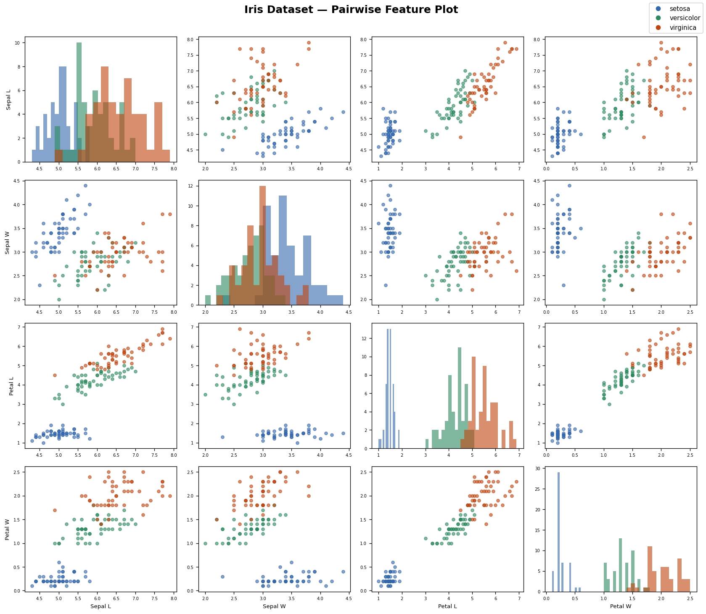
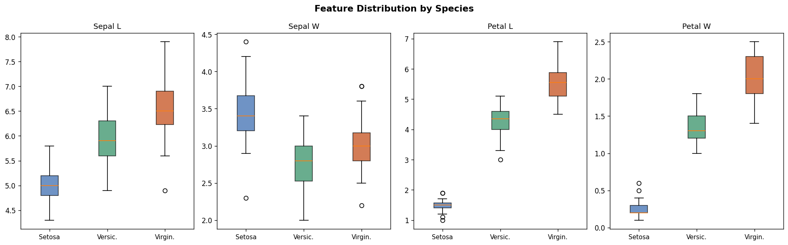
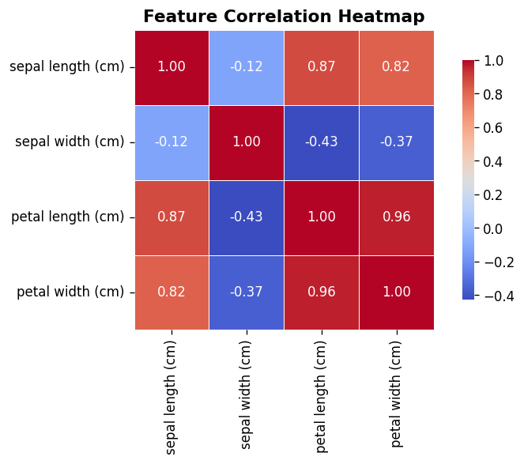
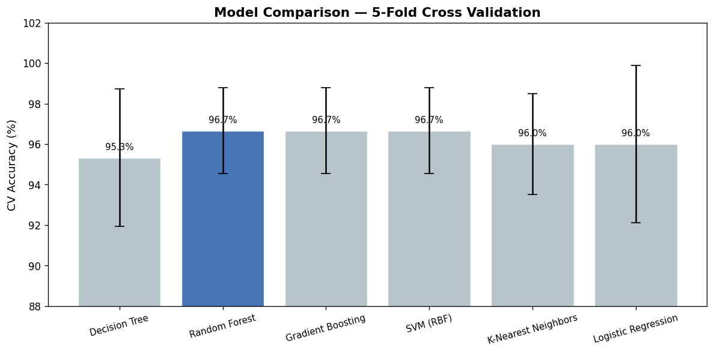
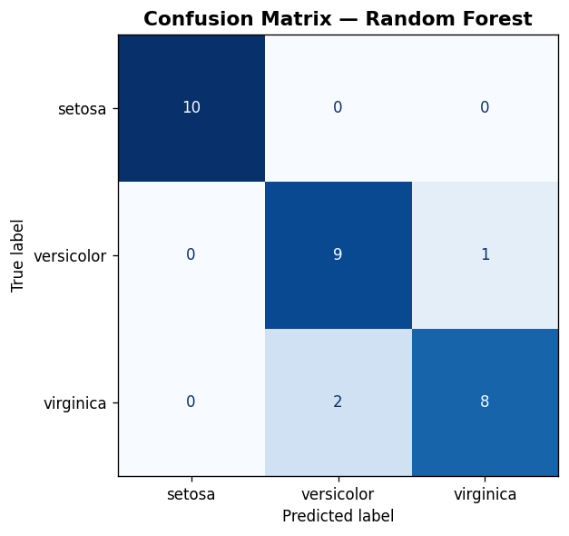
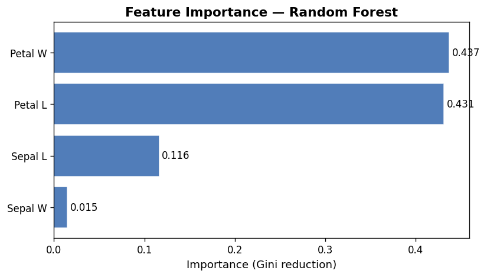
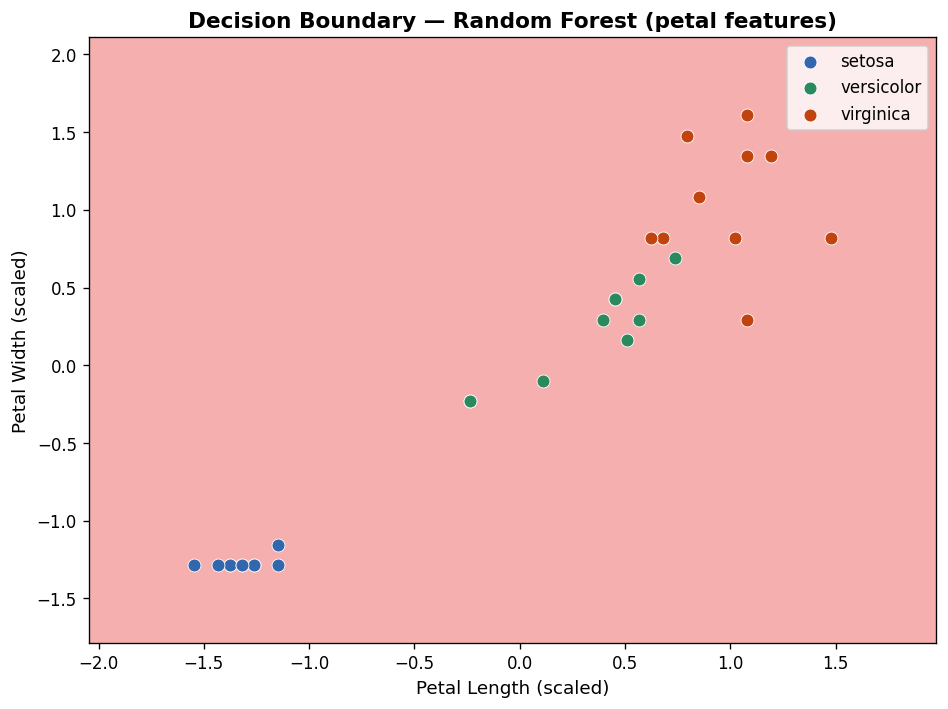

# 🌸 Iris Flower Classification

A complete end-to-end machine learning project that classifies iris flowers into three species — **Setosa**, **Versicolor**, and **Virginica** — using six different ML algorithms, full evaluation, hyperparameter tuning, and rich visualizations.

---

## 📋 Table of Contents

- [Overview](#overview)
- [Dataset](#dataset)
- [Project Structure](#project-structure)
- [Setup & Installation](#setup--installation)
- [Usage](#usage)
- [Models & Results](#models--results)
- [Visualizations](#visualizations)
- [Sample Terminal Output](#sample-terminal-output)
- [Predicting New Samples](#predicting-new-samples)

---

## Overview

This project trains and evaluates **6 machine learning classifiers** on the classic Iris dataset. It covers the full ML workflow — data exploration, visualization, model training, cross-validation, hyperparameter tuning, and inference on new samples.

| Step | Description |
|---|---|
| Data exploration | Shape, statistics, class distribution, missing values |
| Visualization | Pairwise plots, box plots, correlation heatmap |
| Model training | 6 classifiers wrapped in a StandardScaler pipeline |
| Evaluation | Test accuracy + 5-fold cross-validation |
| Best model report | Confusion matrix + full classification report |
| Feature importance | Gini impurity reduction per feature |
| Decision boundary | 2D decision regions on petal features |
| Hyperparameter tuning | `GridSearchCV` on Random Forest |
| New predictions | Species + probability scores for custom inputs |

---

## Dataset

The [Iris dataset](https://scikit-learn.org/stable/auto_examples/datasets/plot_iris_dataset.html) (Fisher, 1936) is built into scikit-learn.

| Property | Value |
|---|---|
| Total samples | 150 |
| Samples per class | 50 |
| Features | Sepal length, Sepal width, Petal length, Petal width |
| Classes | Setosa, Versicolor, Virginica |
| Missing values | None |

---

## Project Structure

```
iris_classifier/
├── main.py              # Complete ML pipeline
├── requirements.txt     # Python dependencies
├── README.md            # This file
├── plot_pairwise.png
├── plot_boxplots.png
├── plot_correlation.png
├── plot_model_comparison.png
├── plot_confusion_matrix.png
├── plot_feature_importance.png
└── plot_decision_boundary.png
```

---

## Setup & Installation

### Prerequisites
- Python 3.8+
- pip or pip3

### Install dependencies

```bash
pip3 install numpy pandas matplotlib seaborn scikit-learn
```

Or using the requirements file:

```bash
pip3 install -r requirements.txt
```

---

## Usage

```bash
python3 main.py
```

That's it — the script runs the full pipeline and saves all 7 plots to the current directory.

---

## Models & Results

Six classifiers were trained and evaluated using 5-fold cross-validation:

| Model | Test Accuracy | CV Accuracy | CV Std |
|---|---|---|---|
| **Random Forest** ⭐ | 90.0% | **96.7%** | ±2.1% |
| Gradient Boosting | 96.7% | 96.7% | ±2.1% |
| SVM (RBF) | 96.7% | 96.7% | ±2.1% |
| Decision Tree | 93.3% | 95.3% | ±3.4% |
| K-Nearest Neighbors | 93.3% | 96.0% | ±2.5% |
| Logistic Regression | 93.3% | 96.0% | ±3.9% |

> ⭐ Random Forest selected as best model based on CV score stability.

### Best Model — Classification Report

```
              precision    recall  f1-score   support

      setosa       1.00      1.00      1.00        10
  versicolor       0.82      0.90      0.86        10
   virginica       0.89      0.80      0.84        10

    accuracy                           0.90        30
   macro avg       0.90      0.90      0.90        30
weighted avg       0.90      0.90      0.90        30
```

### Hyperparameter Tuning (GridSearchCV)

```
Best params   : {'clf__max_depth': None, 'clf__min_samples_split': 2, 'clf__n_estimators': 100}
Best CV score : 96.67%
```

---

## Visualizations

### Pairwise Feature Plot


> Each cell shows scatter plots between two features (off-diagonal) or a histogram per species (diagonal). Notice how **petal length vs petal width** separates all three species cleanly.

---

### Feature Distribution by Species (Box Plots)


> Setosa has distinctly smaller petals. Versicolor and Virginica overlap slightly in sepal measurements but differ clearly in petal dimensions.

---

### Feature Correlation Heatmap


> Petal length and petal width are highly correlated (r = 0.96). Sepal width has the weakest correlation with other features.

---

### Model Comparison


> All models achieve 95%+ cross-validated accuracy. Error bars show standard deviation across the 5 folds.

---

### Confusion Matrix (Random Forest)


> Setosa is classified perfectly. The only misclassifications occur between Versicolor and Virginica, which partially overlap in feature space — a well-known property of this dataset.

---

### Feature Importance


> **Petal length** and **petal width** are by far the most discriminative features. Sepal width contributes the least to classification.

---

### Decision Boundary (Petal Features)


> Decision regions learned by the best model using only petal length and width. The three species are well-separated, with a narrow overlap zone between Versicolor and Virginica.

---

## Predicting New Samples

```
Sample             Predicted        Setosa   Versicolor  Virginica
----------------------------------------------------------------
Likely Setosa      setosa           100.0%         0.0%       0.0%
Likely Versicolor  versicolor         0.0%        92.0%       8.0%
Likely Virginica   virginica          0.0%         0.0%     100.0%
Borderline         versicolor         0.0%       100.0%       0.0%
```

---

## Sample Terminal Output

```
============================================================
           IRIS FLOWER CLASSIFICATION
============================================================

Dataset shape : (150, 5)
Classes       : ['setosa', 'versicolor', 'virginica']
Samples/class : {'setosa': 50, 'versicolor': 50, 'virginica': 50}

── First 5 rows ──
 sepal length (cm)  sepal width (cm)  petal length (cm)  petal width (cm) species
               5.1               3.5                1.4               0.2  setosa
               4.9               3.0                1.4               0.2  setosa
               4.7               3.2                1.3               0.2  setosa
               4.6               3.1                1.5               0.2  setosa
               5.0               3.6                1.4               0.2  setosa

── Statistical summary ──
       sepal length (cm)  sepal width (cm)  petal length (cm)  petal width (cm)
count             150.00            150.00             150.00            150.00
mean                5.84              3.06               3.76              1.20
std                 0.83              0.44               1.77              0.76
min                 4.30              2.00               1.00              0.10
25%                 5.10              2.80               1.60              0.30
50%                 5.80              3.00               4.35              1.30
75%                 6.40              3.30               5.10              1.80
max                 7.90              4.40               6.90              2.50

── Missing values ──
sepal length (cm)    0
sepal width (cm)     0
petal length (cm)    0
petal width (cm)     0
species              0

[Saved] plot_pairwise.png
[Saved] plot_boxplots.png
[Saved] plot_correlation.png

============================================================
           MODEL TRAINING & EVALUATION
============================================================

Decision Tree
  Test accuracy : 93.3%
  CV 5-fold     : 95.3% ± 3.4%

Random Forest
  Test accuracy : 90.0%
  CV 5-fold     : 96.7% ± 2.1%

Gradient Boosting
  Test accuracy : 96.7%
  CV 5-fold     : 96.7% ± 2.1%

SVM (RBF)
  Test accuracy : 96.7%
  CV 5-fold     : 96.7% ± 2.1%

K-Nearest Neighbors
  Test accuracy : 93.3%
  CV 5-fold     : 96.0% ± 2.5%

Logistic Regression
  Test accuracy : 93.3%
  CV 5-fold     : 96.0% ± 3.9%

============================================================
  BEST MODEL: Random Forest  (96.7% CV accuracy)
============================================================

Classification Report:
              precision    recall  f1-score   support

      setosa       1.00      1.00      1.00        10
  versicolor       0.82      0.90      0.86        10
   virginica       0.89      0.80      0.84        10

    accuracy                           0.90        30
   macro avg       0.90      0.90      0.90        30
weighted avg       0.90      0.90      0.90        30

[Saved] plot_model_comparison.png
[Saved] plot_confusion_matrix.png
[Saved] plot_feature_importance.png
[Saved] plot_decision_boundary.png

============================================================
     HYPERPARAMETER TUNING — Random Forest
============================================================
Best params   : {'clf__max_depth': None, 'clf__min_samples_split': 2, 'clf__n_estimators': 100}
Best CV score : 96.67%

============================================================
         PREDICTING NEW FLOWER SAMPLES
============================================================

Sample             Predicted        Setosa   Versicolor  Virginica
----------------------------------------------------------------
Likely Setosa      setosa           100.0%         0.0%       0.0%
Likely Versicolor  versicolor         0.0%        92.0%       8.0%
Likely Virginica   virginica          0.0%         0.0%     100.0%
Borderline         versicolor         0.0%       100.0%       0.0%

✓ All done! Check the generated PNG plots in this directory.
```

---

## License

This project is open source and available under the [MIT License](LICENSE).
